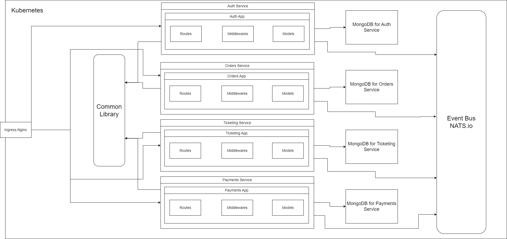

# Microservices-Blog

This is a ticketing application built on microservices architecture. This application have several features:

- Users can list tickets for an event for sale. 
- Users can purchase that ticket after signing up and providing credit card information.
- Tickets will be locked for 15 minutes while the user is trying to purchase it.
- If the ticket is not purchased in 15 minutes, the ticket will become available again.
- Users can list a ticket for sale and can edit or delete the ticket.

The application is built using the following technologies:

- React and Next.js for the frontend
- Node.js and Express for the backend
- MongoDB for the database
- NATS Streaming Server for event bus
- Docker and Kubernetes for containerization and deployment
- Skaffold for deployment to Kubernetes cluster
- Github Actions for CI/CD
- Stripe for payment processing
- Jest and Supertest for testing
- Typescript for type checking

I added the architecture diagram above to illustrate the components and their interactions in the application.

## Prerequisites

Make sure you have the following installed on your machine:

- Node.js
- NPM
- Docker
- Kubernetes
- Skaffold

## Getting Started

To get the application up and running locally, follow these steps:

1. Clone the repository: `git clone https://github.com/ahsandani001/ticketing.git`
2. Create Docker images for all services: `docker build -t your-username/{service} .`
3. Deploy the application to Kubernetes using Skaffold: `skaffold dev`

## Docker and Kubernetes

The application is containerized using Docker and can be deployed to a Kubernetes cluster using Skaffold. To deploy the application, follow these steps:

1. Make sure you have Docker and Kubernetes installed and configured on your machine.
2. Build the Docker image for all services: `docker build -t your-username/{service} .`
3. Deploy the application to Kubernetes using Skaffold: `skaffold dev`

## Contributing

Contributions are welcome! If you find any issues or have suggestions for improvements, please open a GitHub issue or submit a pull request.